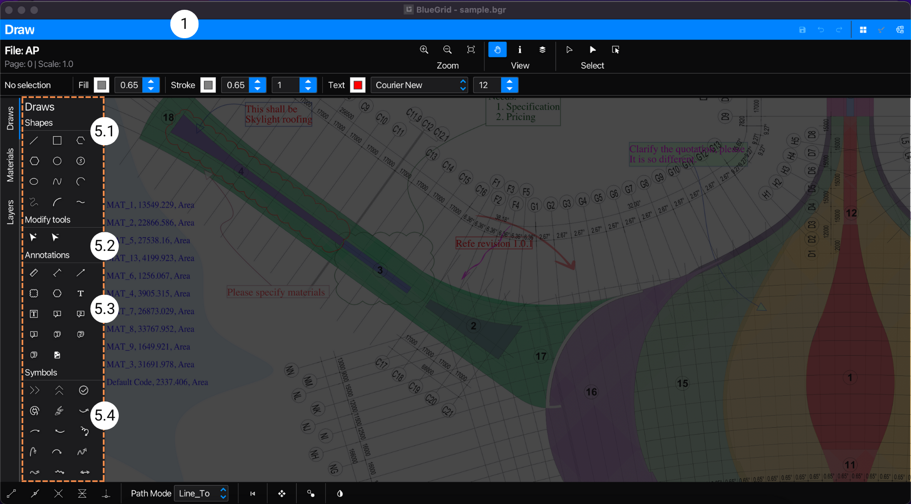
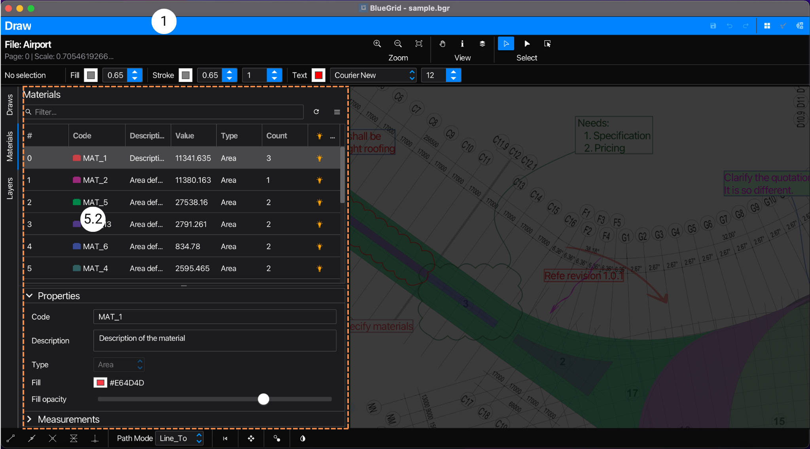

## Application

Application is the main window of BlueGrid, where users perform quantity take-off projects.

Operations in the application are at project level. This means that the changes made in the application are applied to the project. Data of project is stored in the project file.

### User Interface
> The application has an [Application Tool Bar](#application-tool-bar) and 3 sub-views: [Document View](#document-view), [Draw View](#draw-view), and [Catalog View](#catalog-view). At a time, there is only one of the views is displayed. Users can change view via **Application Tool Bar**

> 

> 1. [Application Tool Bar](#application-tool-bar)
> 2. [Sub-view](#sub-view)

> #### Application Tool Bar
```Navigation: Application | Application Tool Bar```

> The **Application Tool Bar** is on the top of the application view and is always visible by default. From the **Application Tool Bar**, you do common operation such as save, undo, redo, and navigate to different sub-views of the application, for the purposes of use. 

> #### Sub-view
```Navigation: Application | Sub-view```

> Sub-view of can be either [Document View](#document-view), [Draw View](#draw-view), or [Catalog View](#catalog-view). Each sub-view has its own functionalities and functions. All sub-views share the same project data. The Documents View is the default sub-view of the application, when you open a project.

## Document View
```Navigation: Application | Documents View```

> **Documents View** the view of project construction blueprints of PDF folders and pages.

### User Interface
> The user interface is designed to facilitate PDF view (as thumbnails) and simple but powerful PDF blueprints management.

> 

> 1. [Application Tool Bar](#application-tool-bar)
> 2. [Folders](#folders) 
> 3. [Pages](#pages) 
> 4. [Folders menu](#folders-menu)
> 5. [Pages menu](#folders-menu)
> 6. [Page thumbnails](#page-thumbnials)
> 7. [Pages context menu](#pages-context-menu)


> #### Folders
```Navigation: Application | Documents View | Folders```

> **Folders** is a list view that displays all PDF folders of the project. Users can click a folder item in the list to open it. To remove a folder from the list, select the folder item in the list, open [Folders Menu](#folders-menu), and select delete menu item.

> #### Pages
```Navigation: Application | Documents View | Pages```

> **Pages** is a grid view that displays PDF pages in thumbnails of an opened folder. To open a page, user double-click the page thumbnail or select Open in the Page Context Menu. To remove a page , select the page thumbnail, open [Pages Menu](#pages-menu) or right-click the page  thumbnail to open context menu, and select **Delete Pages** menu item.

> #### Folders menu
```Navigation: Application | Documents View | Folders | Folders menu```

> **Folders menu** is a menu that provides functions to manage PDF folders such as add, delete, rename... To open the menu, right-click the folder list or click the menu button on the top-right corner of the folder list.

> #### Pages menu
```Navigation: Application | Documents View | Pages | Pages menu```

> **Pages menu** is a menu that provides functions to manage PDF pages of a folder such as open, delete, append, import, export, duplicate... To open the menu,  click the menu button on the top-right corner of the page list. Users can also select multiple pages to perform batch operations such as delete, export, duplicate...

> #### Page thumbnails
```Navigation: Application | Documents View | Pages | Page thumbnails```

> Under-laying data of a page thumbnail is the page data set which consists of the PDF page, shapes, materials, annotations, and any data the user added to the page.To open a page, user double-click the page thumbnail or select Open in the [**Page Context Menu `7` **](#pages-context-menu). By opening a page, the application navigates to the [Draw View](#draw-view), loads data page set into the Draw View.

> #### Pages context menu
```Navigation: Application | Documents View | Pages | Page context menu```

> **Page context menu** is a menu that provides functions to manage selected PDF pages such as open, delete, append, import, export, duplicate... To open the menu, right-click the page thumbnail. Users can also select multiple pages to perform batch operations such as delete, export, duplicate... **Page context menu** has similar functions as [Pages menu](#pages-menu) as another option to accent pages functions by using right-click.


## Draw View
```Navigation: Application | Draw View```

> **Draw View** is the centric interface of the application. It is where users perform quantity take-off, create and edit shapes, materials, tags, annotations, images...etc.

### User Interface

> When you open a page, the Draw View interface looks as follows:

> 
> 
> 1. [Application Tool Bar](#application-tool-bar)
> 2. [Draw Tool Bar](#draw-tool-bar)
> 3. [Free Shape Format Tool Bar](#free-shape-format-tool-bar)
> 4. [Draw Canvas](#draw-canvas)
> 5. [Left Panel](#left-panel)
> 6. [Bottom Bar](#bottom-bar)

> #### Draw Tool Bar
```Navigation: Application | Draw View | Draw Tool Bar```

> **Draw Tool Bar** is a toolbar that provides tools to operate on the Draw Canvas. The tools are categorized into 3 groups: [Zoom](#zoom), [View](#view), and [Select](#select).

> #### Free Shape Format Tool Bar
```Navigation: Application | Draw View | Free Shape Format Tool Bar```

> **Free Shape Format Tool Bar** is a toolbar that provides tools to style free shapes, texts and annotations. With these tools use can change style properties such as color, line width, opacity, font, font size, etc. of free shapes, texts and annotations. Tagged shapes are not affected by these tools. Tagged shapes are style by their styling tags such as [materials](/material).
> 
> #### Draw Canvas
```Navigation: Application | Draw View | Draw Canvas```

> **Draw Canvas** is the centric component of the Draw View, The Draw Canvas is a PDF viewer that displays PDF the opened PDF page. The Draw Canvas is also a drawing board that allows users to draw shapes, add notes, annotations and images, tag and untag materials...etc. The Draw Canvas is where users perform quantity take-off by drawing shapes and the application compute their metric properties such length, area, volume and of course counting. The data in Draw Canvas is at page level.

> #### Left Panel
```Navigation: Application | Draw View | Left Panel```

> **Left Panel** is a panel that allows users to switch to between tab panes of the Draw View. These tabs contain tools and data that co-relate to Draw Canvas's data. The data displayed is at page level. There are 3 tabs: [Draw Tab](#draw-tab), [Material Tab](#material-tab), and [Layer Tab](#layer-tab).

> ##### Draws TabPane
```Navigation: Application | Draw View | Left Panel | Draws TabPane```
> **Draws TabPane `5.1`** is displayed when user select Draws tab in the Left Panel, as follows:

> 
> *Draw Tab** is a tab pane that contains tools to draw shapes, add notes, annotations and images...etc. In **Draw TabPane** there are 4 tool sets:

  1. **Shape Tools** allow users to draw 2D shapes that are used to compute metric values such as length, area, and volume. Shapes created using these tools are of Metric class and can be tagged to materials.
  2. **Modify Tools** allow users to change 'native' data of shapes,  e.g: to remove points from a polygon, to insert points to polygon. These tools are not used to add shapes or annotations.
  3. **Annotation Tools** allow users to add texts, annotations such as arrow, callouts, clouds, images..etc. Objects created using these tools are not of Metric class and can not be tagged to materials.
  4. **Symbol Tools** is a dynamic tool set that user can to add, remove, or customize tools. These tools allow users to add blocked shapes which can not be changed 'natively'. Shapes added using these tools are of Metric class can also be used as counting when tagged to materials.

> ##### Materials TabPane
```Navigation: Application | Draw View | Left Panel | Materials TabPane```

> **Materials TabPane `5.2`** is displayed when user select Materials tab in the Left Panel, as follows:
>
> 
  
> **Material TabPane** is a tab pane that contains material table that will be used to apply/tag to shapes. Once shapes are tagged to with a material, the shape style is bound to the material's style. 
> The quantity of the material is the sum of all shapes metric values that are tagged with it. Please take notes that users should trigger [Compute Button](#compute-button) to compute the quantity of the material.
> The material table is at page level.

> ##### Layers TabPane
```Navigation: Application | Draw View | Left Panel | Layers TabPane```

> **Layers TabPane `5.3`** is displayed when user select Layers tab in the Left Panel, as follows:

> **Layers TabPane** is a tab pane that contains layer table that will be used to manage rendering objects in the PDF page by turning on/off layers. This feature will be useful when the PDF page has many layers and users want to focus on  specific layers as well as reducing noise. 


