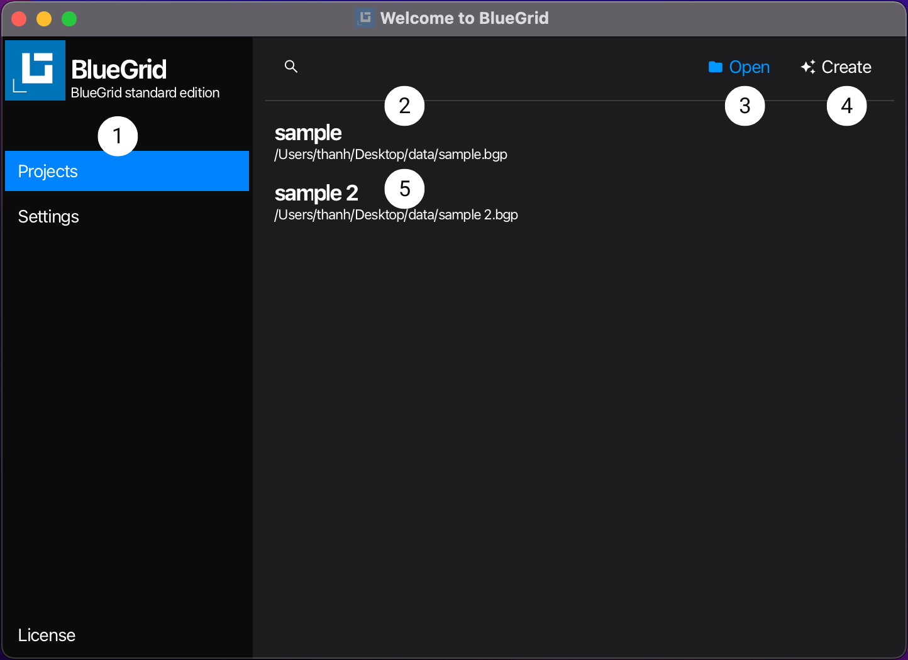
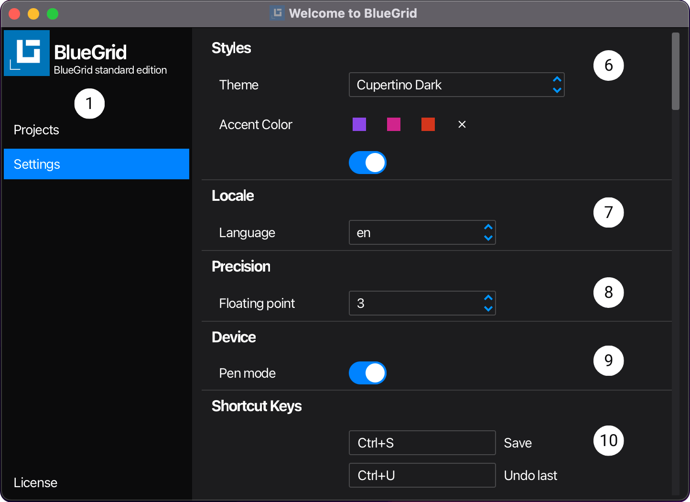
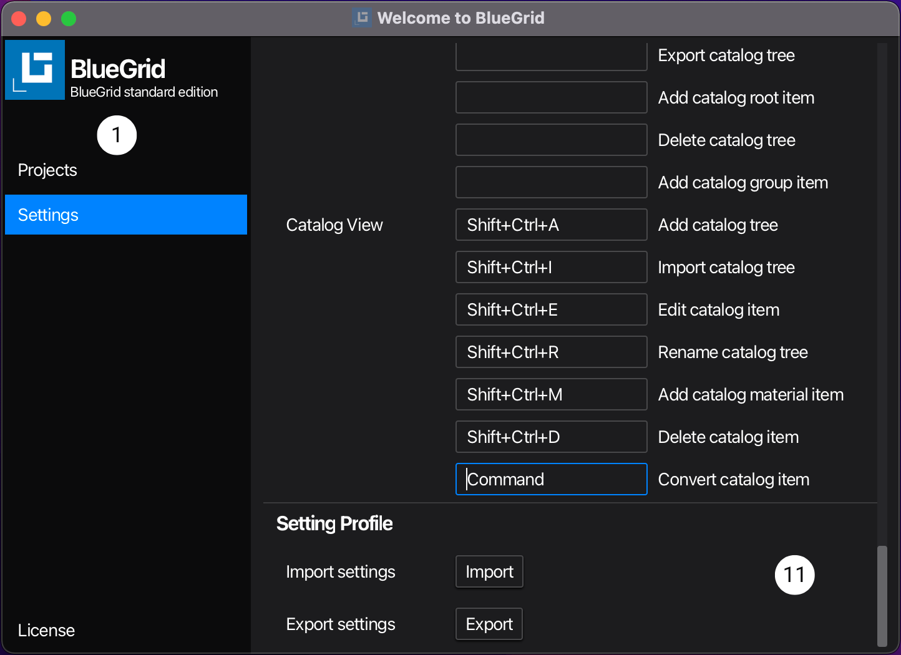

# Starter

Starter is the entry window of BlueGrid. From the starter users open, create, modify shortcut keys, or customize looks and feels as well as set application parameters to optimize usage experience. 

Operations in the **Starter** are at application level. This means that the changes made in the **Starter** are applied to the application as a whole, not to a specific project. Data of application is stored in the settings profile file.

### User Interface
>  When you start BlueGrid, the default user interface looks as follows:
> 
>  
> 
>  Setting view in the starter interface:
> 
>  
> 
> 
> 
> 1. [Navigation Bar](#navigation-bar)
> 2. [Project Filter](#project-filter)
> 3. [Open](#open)
> 4. [Create](#create)
> 5. [Project List](#project-list)
> 6. [Style](#style)
> 7. [Locale](#locale) 
> 8. [Precision](#precision) 
> 9. [Device](#device) 
> 10. [Shortcut Keys](#shortcut-keys)
> 11. [Setting Profile](#setting-profile)

### Navigation Bar
  ```Navigation: Starter | Navigation Bar```  

   **Navigation Bar** is on the left of the starter view and is always visible by default. From the navigation bar, you navigate to different sub-views of the starter, for the purposes of use. Sub-view Project is the default sub-view of the starter view. 
   At current version of BlueGrid, the starter view has 3 sub-views: Project, Setting, and License.
### Project Filter
```Navigation: Starter | Projects | Project Filter```

   **Project Filter** is a text input control, that allows users to quickly find a project by typing in a part of the project's name or the project's path. 
### Open
```Navigation: Starter | Projects | Open```

   **Open** is a button control, users click **Open** button to navigate and open a BlueGrid project. Once a project is opened via **Open** button, it will be cached in [**Project List** ```5```](#project-list).
### Create
```Navigation: Starter | Projects | Create```
   
   **Create** is a button control, users click **Create** button to create a BlueGrid project. Once a project is created via **Create** button, it will be cached in [**Project List** ```5```](#project-list).
### Project List
```Navigation: Starter | Projects | Project List```

   **Project List** is list view that displays all BlueGrid projects that have been opened or created. Users can click a project item in the list to open it. To remove a project from the list, hover to the project item in the list and click the cross icon.
### Style
```Navigation: Starter | Settings | Style```

   **Style** is a combo box control, that allows users to select a style for the application. The style is applied to the application immediately after users select it. The application has 4 styles: Prime, Nord, Cupertino, and Dracula, each is with dark and light themes.
### Locale
   ```Navigation: Starter | Settings | Locale```

   **Locale** is a combo box control, that allows users to select a locale for the application. The locale is applied to the application after the **Starter** is closed. The application has 2 locales: English and Vietnamese.
### Precision
   ```Navigation: Starter | Settings | Precision```

   **Precision** is a combo box control that allows users to select the number of digits after the decimal point to be displayed in floating-point numbers within the data view. The selected precision is applied to the application once the **Starter** is closed. The application offers 13 options for the number of digits after the decimal point, ranging from 0 to 12.
### Device
   ```Navigation: Starter | Settings | Device```

BlueGrid is an application designed to target multiple platforms and devices. As such, **Device** is the setting section that allows users to select device options such as pen, touch, mouse, desktop, or tablet. These options help optimize user experiences and work efficiency. The selected device options are applied to the application once the **Starter** is closed. The application currently offers two device options: Desktop/Tablet and Mouse/Pen.
### Shortcut Keys
   ```Navigation: Starter | Settings | Shortcut Keys```

**Shortcut Keys** is a settings section that allows users to customize shortcut keys for the application. The customized shortcut keys are applied to the application once the **Starter** is closed. Shortcut keys are categorized into four groups and two levels: Application (level 0), Draw View (level 1), Document View (level 1), and Catalog View (level 1). Each group contains a list of shortcut keys that users can customize. Shortcut keys at a lower level have a higher execution priority, meaning a shortcut key at a higher level will not execute if a lower-level key shares the same shortcut, the lower level shortcut key executes. 

Identical shortcut keys in different groups at the same level will have the same execution priority. For example, the shortcut key ‘Ctrl + O’ in the Draw View group and ‘Ctrl + O’ in the Document View group will have the same execution priority. Different groups can share shortcut keys. In the same group, shortcut keys shall be unique. 
### Setting Profile
   ```Navigation: Starter | Settings | Setting Profile```
   
**Setting Profile** A setting profile contains information of all application including theme, style, precision, shortcut. keys etc... Settings section that allows users to save and load setting profiles.  For example, users can save a settings profile for a desktop device and another for a tablet device. 
